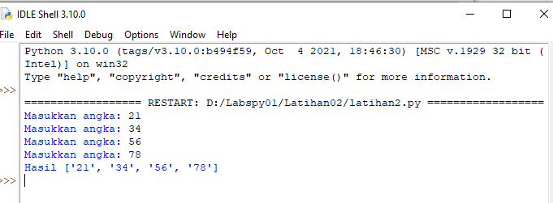

# Labspy01
### Latihan 1 (Mencari Bilangan Terbesar)

Buatlah nilai integer input seperti gambar diatas untuk menginput nilai setelah itu gunakan <i>if</i> dengan perumpaan jika nilai a lebih besar dari a maka <i>print</i> a dan <i>else</i> <i>print</i> b. Setelah selesai coding akan muncul output seperti gambar dibawah

### Latihan 2 (Mengurutkan Bilangan Terkecil ke Terbesar)

Buatlah inter a untuk memasukkan berapa angka yang ingin diurutkan setelah itu buatlah <i> for i</i> dengan int a untuk range. Kemuadian jika ingin mengurutkan gunakan syntax <i>sort</i> setelah itu print.

### Latihan 3 (Perulangan Bilangan Bertingkat)

Buatlah integer baris  dan kolom dengan range 10. print baris+kolom untuk menambah kearah kanan dan gunakan syntax <i>end</i> terakhir gunakan<i> Print ()</i> untuk memberkian enter setiap angka 10.

